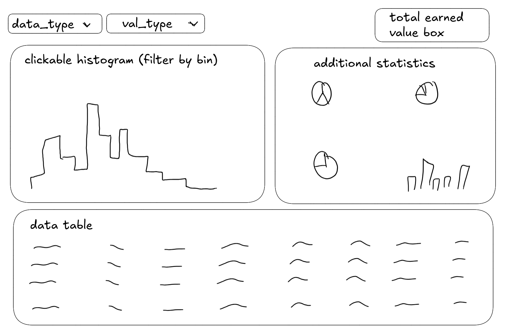

## Description
This is a dashboard to be used in e-commerce website to extract useful sales information.
It provides insights into sales trends, influence of discounts, recommendations for products, and customer behavior.
It helps to discover the most popular products, categories and periods of sales.

NOTE: This dashboard works on a fake, synthetic dataset, it may not reflect real-world data.
The internet shop albox.pl is a new website, so there is no real data available yet.
The dataset, however, agrees with database schema and is used to test the dashboard.

## Sketch of the dashboard

## Github repository
[GitHub Repository](https://github.com/rybijakKarpiowy/data_viz_dashboard)

## Live demo
[Live Demo](https://rybijak-karpiowy.shinyapps.io/data_viz_dashboard/)